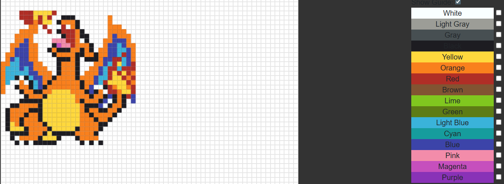
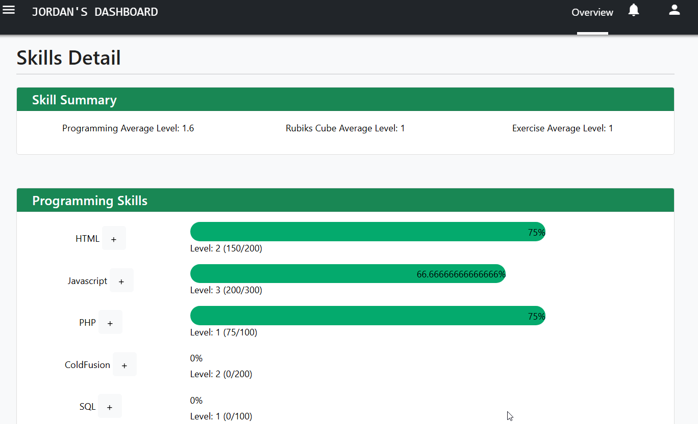

# 100 Days Of Code - Log

### Day 0: September 1, 2025

**Today's Progress**: Create and publish a test app with Ionic!

**Thoughts:** To start off the 100 days of code, I started down the path of building an android app using Ionic and AngularJS.
I downloaded Node.js and Android studio and the Java JDK. It was a bit confusion going through the NPM and Ionic commands. I mostly followed the tutorial to get the app up and running. 
The next issue I faced was getting the keystore generated. I solved this by double checking the path the keystore file was being saved to. It turns out I wasn't in the right directory for it to save it. Once I changed the path, the keystore generated with no further issues.
The app was the basic photo gallery. Not bad for the first Ionic App I’ve attempted to follow and do. I struggled with getting it uploaded into the Google play store. I didn’t realize that it had to be in AAB format and not the APK. 

I ran into a few additional issues uploading the AAB file to the Google Play store. 
1) the package nameing was an issue. It had to be in com.xxx.xxx format.
2) I didn't realize that the default package was already uploaded into the Play store so I had to rename my temp app.

**Link to work:** The [tutorial](https://ionicframework.com/docs/angular/your-first-app) I used from Ionic.

### Day 1: September 2, 2025

**Today's Progress**: Build a heatmap to track progress!

**Thoughts:** Today I wanted a way to visualize my progress while doing the 100 days challenge. I really like how GitHub displays activity via a heatmap. I started by creating a table and looping from 0-52 to build the week columns and the day values. I was able to get the colors I wanted but it felt clunky. I found this heatmap library called cal-heatmap that I liked so I decided to switch to it. There were some issues I faced when getting the heatmap to load correctly. Once I was more familiar with the library, it worked out really well.

**Link to work:** The [Heatmap Github](https://cal-heatmap.com/) repo I used. 

**Link to work:** See my [Heatmap Demo](./Demos/heatmap.html) that I created. 

### Day 2: September 3, 2025

**Today's Progress**: Build a task tracker and note form!

**Thoughts:** I am very unorganized and often start things and don't finish them because I get distracted by the next thing. I decided to practice my PHP skills and front end development by creating a To-Do list and a note taker. The languages used are jQuery, Bootstrap, PHP for backend and MySQL to store the data. I've worked with PHP what I thought was a lot but my skills are rusty. Using the PDO->Prepare() for connecting to a MySQL database is something that I have done, but it has been a while. I learned more about parameterization with PDO. 

### Day 3: September 4, 2025

**Today's Progress**: Add Bootstrap Modals and look pretty!

**Thoughts:** I decided to focus on improving the UI of the To-Do page that I built yesterday. I hooked up the AJAX methods to be able to comunicate with the APIs I build to Add new tasks, Get the tasks, Get the task detail and mark them as complete. It seem like I didn't do a lot but I did connect a lot of dots to make it function more like a usable application.

### Day 4: September 5, 2025

**Today's Progress**: Crypto Ticker!

**Thoughts:** Today I went with a simple C# application that I have been wanting to do for awhile. I have wanted to create a small application in C# that would be the top most app on the screen and show the current prices of certain cryptos I was interested in. I decided to use the API from Coinbase as my source for the current prices because it has an endpoint that I didn't have to authenticate for. One of the key features that I wanted to build was to have an indicator that shows how much the value has gone up (green) or down (red) as a visual indicator. That was done by keeping a history of the most recent value and compare it against the current value (delta). I used the datagridview element because it had the table look I was going for. The hardest part of this was keeping track of the math. 

**Link to work:** The [Coinbase API](https://api.coinbase.com/v2/exchange-rates) I used. 

Screenshot 1

Screenshot 2

### Day 5: September 6, 2025

**Today's Progress**: ToDo Update and Crypto Ticker Update!

**Thoughts:** After watching the Crypto Ticker for awhile today, I realized there were some bugs in it. I gave the ToDo list some miliage and added the tasks there and realized I didn't have a way to mark tasks as being done. I created the API for that and added a green button to it.

It wasn't correctly showing the delta value even though the current value did change. I realized that the table was updating at a much slower rate than the Coinbase API was being checked. So the delta value would have been updated several times before the table was refreshed. 

I added some alert logic for display a message box if the coins start to go up to fast or down in a give time, or if it reaches a certain price point. It has been fun watching it tick and update. 

### Day 6: September 7, 2025

**Today's Progress**: HTML & CSS Fiddle

**Thoughts:** Today I was inspired by websites like [CFFiddle](https://cffiddle.org/) and [CodePen.io](https://codepen.io/) that have editors that show the result in part of the page. I wanted to create my own mini version to play around with injecting code into iframes. It took me a minute to figure out how to navigate the contentWindow of the iframe in order to get the code to work. The front may not look impressive but I had fun with the Javascript!

Fiddle screenshot

### Day 7: September 8, 2025

**Today's Progress**: Button Generator!

**Thoughts:** The challenge today is to build a button css generator. This proved to me a little more challenging than I expected. I wasn't sure how to best struction the Javascript. Should I do a class? An object? A bunch of variables? In the end I decided to keep it straight forward and have an object that kept all of the css properties together. Then there is only 1 method I needed to call to update the button preview. I ran out of time to get this into a state I like so I will continue it tomorrow!

### Day 8: September 9, 2025

**Today's Progress**: Button Generator pt 2!

**Thoughts:**  I wanted to continue with the button generator. I has fun reviewing some of the details of the different CCS properties that I had forgotten about. For example, I didn't realize that most of the vendor prefixes are not really needed any more. I added several more options like background color gradients and controlling the border radiuses.

### Day 9: September 10, 2025

**Today's Progress**: Day Schedule!

**Thoughts:**  I still struggle with being organized and time mangement. I decided to build a day schedule template that I can fill out and mark done for certain times of the day. I can select from the ToDo list I created earlier or add in an individual item or meeting. I don't have the icons working yet or the priority marking but I plan on doing those. I did put them on the ToDo list though!

### Day 10: September 11, 2025

**Today's Progress**: Day Schedule Redo!

**Thoughts:**  I tried to use the daily schedule I designed previously and it wasn't helpful. I decided to redo it. What I found lacking was it couldn't be updated easily if there were sudden changes to my day. I decided to have the top section be a week overview and then below it, display the daily schedule. Off to the side, I had a checkbox list of things I had to do today. Hopefully this design works better for me.

### Day 11: September 12, 2025

**Today's Progress**: API Pwned!

**Thoughts:**  I wanted to practice some API skills with the Have I Been Pwned API and C#. I built a simple console app that checks the HaveIBeenPwned api for breach info for a given email. It was a fun little Friday project. 

[haveibeenpwned](https://haveibeenpwned.com/API/v3)

### Day 12: September 13, 2025

**Today's Progress**: Save the buttons!

**Thoughts:**  I revisited the button generator. I added the functionality to save button templates into the local storage and reuse them. This was my first time with a usable local storage project. 

### Day 13: September 14, 2025

**Today's Progress**: Iframe and cameras

**Thoughts:**  I spent today building a UI for security cameras that are connected to a BlueIris system. The UI was built with iframes and HTML, CSS and some JS. It allowed me to see the cameras from any device on my home network. It was a fun activity. 

### Day 14: September 15, 2025

**Today's Progress**: C#, CefSharp and events!

**Thoughts:** I've used C# and CefSharp for several years. I've always used the legacy binding for events between Javascript and the C# CefSharp and I decided to use the newer "Register" to bind a C# object to the Javascript front end. It took me a minute because I couldn't figure out how to get the Javascript to see the registered object. I realized that I wasn't using 'BindObjectAsync' in Javascript so it didn't exist.

### Day 15: September 16, 2025

**Today's Progress**: Button Strikes Back!

**Thoughts:** I returned to the button generator again. I wanted to add options for the hover effects. I enjoyed getting into the different things like size, color, background and size for only the on hover. It's really coming together. I think I need to make it a standalone project and push it to Github to share. 

### Day 16: September 17, 2025

**Today's Progress**: Portfolio!

**Thoughts:** Today I began working on a portfolio website for me. I think I have a good layout but I've been struggling with the content. I kept it simple in design and so far it only uses HTML/CSS/Javascript. I don't think I'll have a need for PHP except for any contact/email functions. 

### Day 17: September 18, 2025

**Today's Progress**: C# and game library!

**Thoughts:** I finished the C# and CefSharp project I started a few days ago. I added a UI in HTML to display all the games I have installed on my gaming PC and connected the buttons to launch the games. I wanted to display the games like on a shopping webside and have a button that launches them. 

### Day 18: September 19, 2025

**Today's Progress**: Pixel Art!

**Thoughts:** Today I played with creating a pixel art maker. I wanted to create a gid in HTML Canvas that would allow me to click sections and draw! This took much longer than an hour but I had so much fun creating it. The Layout isn't responsive but it allowed for a good framework to start with. 

Pixel screenshot

### Day 19: September 20, 2025

**Today's Progress**: Pixel Art pt 2!

**Thoughts:** I was enjoying playing with the pixel maker. I decided to add some layering to the cavas and the ability to lock colors so they couldn't be changed. I ran into an issue trying to figure out how to layer the colors correctly on the redraw of the canvas but after some trial and error I found my issue. 

### Day 20: September 21, 2025

**Today's Progress**: Pixel Art pt 3!

**Thoughts:** I spent more time on the pixel maker today. I was trying to save the progress of the image but I haven't been able to work out how I want to do that. Right now I'm using the local storage but I want to save it to my server so I can use it on different devices. I haven't gotten that to work yet. 

### Day 21: September 22, 2025

**Today's Progress**: Pixel Art pt 4!

**Thoughts:** Another day with the pixel maker. I decided on a save path. I will store pass the save data as json and save it as a blob. I also added an export function to download the JSON. It took me some time with the PHP to be able to successfully store the JSON. I changed the format a few times and had to restart because the previous saves were no longer good. 

### Day 22: September 23, 2025

**Today's Progress**: Random Stuff!

**Thoughts:** Today I was a bit all over the place. I fixed a few bugs on the button generator and worked on the pixel maker. I created a C# CefSharp project and worked on adding both projects into it via HTML. 

### Day 23: September 24, 2025

**Today's Progress**: Skill Tracker!

**Thoughts:**  For day 24 I wanted to create a simple skill tracker. I wanted a way to visually show an indicator of my skills and encourage me to level them up. Almost like a video game RPG leveling system. I spent some time researching good formulas for a leveling system and I decided on a linear formula. Level = X * (X - 1). I wanted to develop skills in 3 areas for now, programming, excercises, and Rubik's cube. 

### Day 24: September 25, 2025

**Today's Progress**:Skill Tracker pt 2!

**Thoughts:** I worked on the Javascript of the skill tracker. I had some bugs with calculating the leveling of the different skills. I didn't want to show how much exp for it to level up but to calculate the level given an amount of exp. It wasn't a lot of front end work but it was more JS related. 

Tracker screenshot
